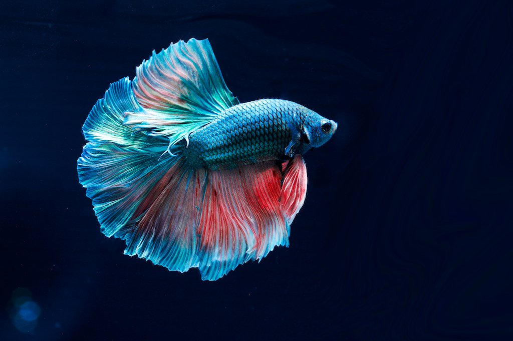

# Example Project

Brief overview of your project.

## Table of Contents

[Installation](#installation)

[Usage](#usage)

[Contribution](#contribution)

[Tests](#tests)

[Images](#images)

[Questions](#questions)

----

### Installation

What are the steps required to install your project? Provide a step by step description of how to get the development environment running.

 * step one 
 * step two 
 * step three

### Usage

Provide instructions and examples for use. Include screenshots as needed. 

### Contribution

List your collaborators, if any, with links to their GitHub profiles.

### Tests

Go the extra mile and write tests for your application. Then provide examples on how to run them. 
 * example one 
 * example two

### Images

 
 
 

----

### Questions
#### Contact Me

Feel free to contact me via GitHub or email with any feedback - thanks for checking out my code!

[GitHub u/eaclumpkens](https://github.com/eaclumpkens)
eaclumpkens@gmail.com
